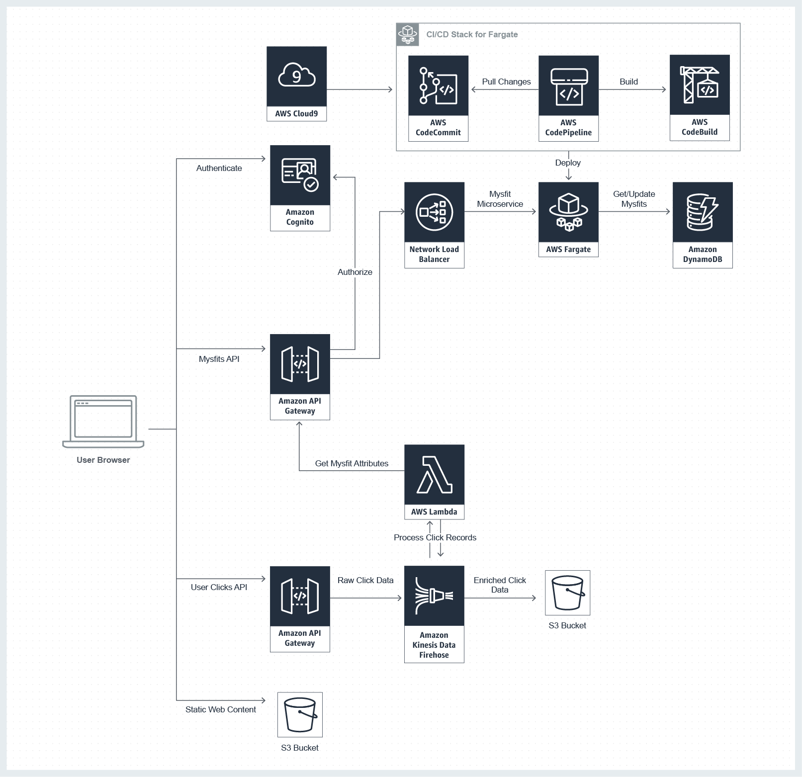

# Mythical Mysfits Web APP on AWS(JAVA-Spring Boot)

**Services used:**
* [Amazon ECS](https://aws.amazon.com/ecs/)
* [Amazon EC2](https://aws.amazon.com/ec2/)
* [Amazon VPC](https://aws.amazon.com/vpc/)
* [Amazon CloudFormation](https://aws.amazon.com/cloudformation/)
* [Amazon DynamoDB](https://aws.amazon.com/dynamodb/)
* [Amazon CodePipeline](https://aws.amazon.com/codepipeline/)
* [Amazon CodeBuild](https://aws.amazon.com/codebuild/)
* [Amazon CodeCommit](https://aws.amazon.com/codecommit/)
* [Amazon IAM](https://aws.amazon.com/iam/) 
* [Amazon Cognito](http://aws.amazon.com/cognito/)
* [Amazon API Gateway](https://aws.amazon.com/api-gateway/)
* [Amazon Simple Storage Service (S3)](https://aws.amazon.com/s3/)

## Overview

This project has built by following aws-modern-application workshop. 

* A static website served static directly from Amazon S3
* Created the Core infrastructure using AWS CloudFormation
* BackEnd has built as microservice API created using Java and Spring Boot. This service has stored into a docker container and then pushed to the Amazon Elastic Container Registery which pulled by Amazon Elastic Container Service using Serverless option, Fargate instead of EC2. 
* Created pipeline to continuously delivery newly built artifacts to our service in ECS Fargate. 
* Added data tier using a DynamoDB table to make the website future more extensible and flexible. 
* Provided authetication and register for users on this website using AWS Cognito, and API Gateway. 

## [AWS Developer Center](https://developer.aws)
